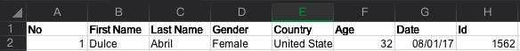
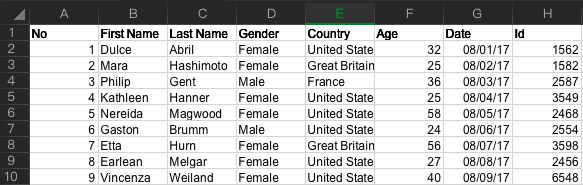
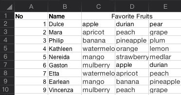
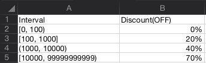

# Excel Schema

Read excel in a lazy way😑.

## Installation

```bash
npm install @csyakamoz/excel-schema
# or
yarn add @csyakamoz/excel-schema
```

## Usage

### Single Data

If your sheet like the image:



Then, you can read it like the code below:

```javascript
const {
  Schema: { array, date, boolean, custom, number, string },
  Executor,
} = require('@csyakamoz/excel-schema');

const data = Executor(
  // excel file
  file,
  // your schema
  {
    no: number().point('A2'),
    firstName: string().point('B2'),
    lastName: string().point('C2'),
    gender: string().point('D2'),
    country: string().point('E2'),
    age: number().point('F2'),
    date: date().point('G2'),
    id: string().point('H2'),
  },
  /**
   * sheet index or sheet name
   * this is optional, the default is 0
   */
  { sheet: 0 }
);

// JSON.stringify(data, null, 4)
{
    "no": 1,
    "firstName": "Dulce",
    "lastName": "Abril",
    "gender": "Female",
    "country": "United States",
    "age": 32,
    "date": "2017-08-01T00:00:00.000Z",
    "id": "1562"
}
```

### Array Data



```javascript
const data = Executor(
    file,
    array()
        .range('A2', 'H10')
        .interval(1, 8)
        .item({
            no: number().point('A2'),
            firstName: string().point('B2'),
            lastName: string().point('C2'),
            gender: string().point('D2'),
            country: string().point('E2'),
            age: number().point('F2'),
            date: date().point('G2'),
            id: string().point('H2'),
        }),
);

// JSON.stringify(data, null, 4)
[
    {
        "no": 1,
        "firstName": "Dulce",
        "lastName": "Abril",
        "gender": "Female",
        "country": "United States",
        "age": 32,
        "date": "2017-08-01T00:00:00.000Z",
        "id": "1562"
    },
    /* ... */
    {
        "no": 9,
        "firstName": "Vincenza",
        "lastName": "Weiland",
        "gender": "Female",
        "country": "United States",
        "age": 40,
        "date": "2017-08-09T00:00:00.000Z",
        "id": "6548"
    }
]
```

### Array In Array Data



```javascript
const data = Executor(
    file,
    array()
        .range('A2', 'E10')
        .interval(1, 5)
        .item({
            no: number().point('A2'),
            name: string().point('B2'),
            favoriteFruits: array()
                .range('C2', 'E2')
                .interval(1, 1) // this line is optional
                .item(string().point('C2')),
        }),
);

// JSON.stringify(data, null, 4)
[
    {
        "no": 1,
        "name": "Dulce",
        "favoriteFruits": [
            "apple",
            "durian",
            "pear"
        ]
    },
    /* ... */
    {
        "no": 9,
        "name": "Vincenza",
        "favoriteFruits": [
            "mulberry",
            "peach",
            "grape"
        ]
    }
]
```

### Custom Data

It supports customizing parsers.



```javascript
const intervalSchema = custom(intervalStr => {
    const pattern = /([([]{1})(\d+),\s*(\d+)([)\]]{1})/;
    const [, leftBracket, begin, end, rightBracket] = intervalStr.match(
        pattern
    );
    const getBoundary = (value, bracket) => {
        const includedList = ['[', ']'];
        return {
            value: Number(value),
            includes: includedList.includes(bracket),
        };
    };

    return [
        getBoundary(begin, leftBracket),
        getBoundary(end, rightBracket),
    ];
});

const data = Executor(
    file,
    array()
        .range('A2', 'B5')
        .interval(1, 2)
        .item({
            interval: intervalSchema().point('A2'),
            discount: number().point('B2'),
        }),
);

// JSON.stringify(data, null, 4)
[
    {
        "interval": [
            {
                "value": 0,
                "includes": true
            },
            {
                "value": 100,
                "includes": false
            }
        ],
        "discount": 0
    },
    /* ... */
    {
        "interval": [
            {
                "value": 10000,
                "includes": true
            },
            {
                "value": 99999999999,
                "includes": false
            }
        ],
        "discount": 0.7
    }
]
```

## License

[MIT](./LICENSE)
